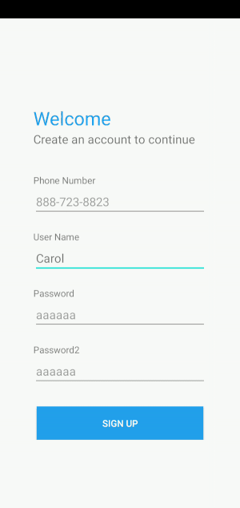
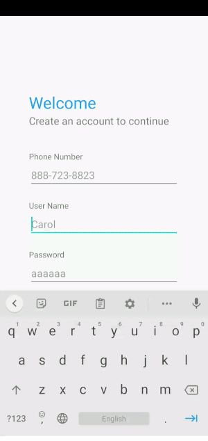
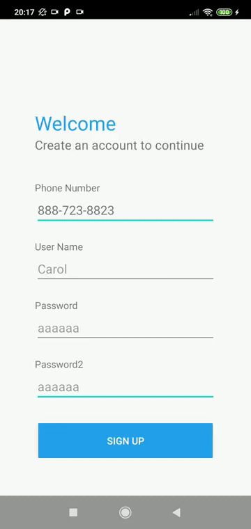
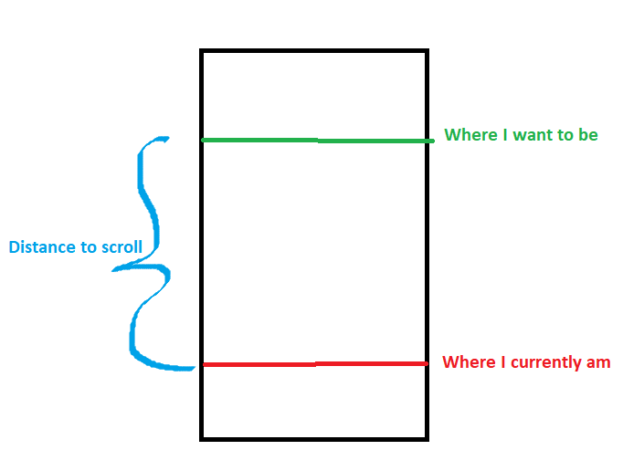
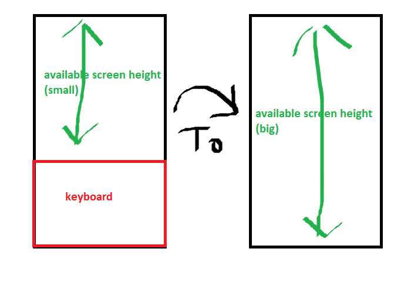
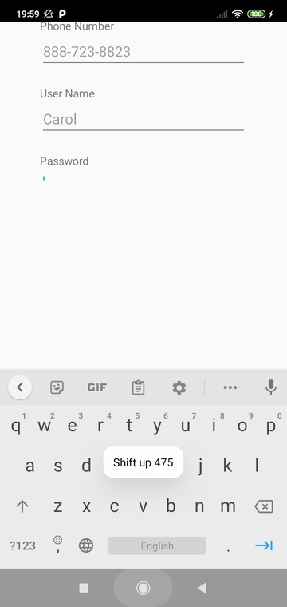

# SoftKeyboardAdjust    
Example of how to pan the page up more with or without full screen mode (works with either adjustPan or adjustResize)    
    
|Custom pan up|Default adjustPan|  
|:---:|:---:|   
|||    

If you have a layout that is resizeable, and you actually want to resize. Use the original AndroidBug5497Workaround.   
    
If you have a layout that is not resizeable, this example shows you how to create the pan up effect (with or without full screen mode)    
* As of why it work with or without full screen mode. Because now we are always listening to the layout height changed and applying our own pan up effect.  
* As of why it work with either adjustPan or adjustResize. Because our layout is not resizeable, so our own pan up effect always take effect.  
        
**Note: This is not a library, this is merely an example.** You must understand how to create these affect to apply them into your own project.    
    
**Note: Only work on portrait mode** In order to work in landscape mode we need to obtain the screen height differently.  
    
### Set Up  

In [MainActivity](https://github.com/yatw/SoftKeyboardAdjust/blob/master/app/src/main/java/com/example/softkeyboardadjust/MainActivity.java), there is a flag USE_IMMERSIVE_MODE to control full screen mode or not.    
   
Experiment with resizeable and non-resizeable layout.  
Experiment with adjustPan and adjustResize input mode.
Experiment with different devices.  
    
The current [activity_main.xml](https://github.com/yatw/SoftKeyboardAdjust/blob/master/app/src/main/res/layout/activity_main.xml) is non resizeable, all margin are fixed distance. A normal adjustResize will not have any affect.    
   
## When to execute the shift up shift down    

 In order for it to shift up when clicking on another editText while keyboard is open. We need to obtain that touch event from editText onTouch or onClick method. And call shift up from there.  
|Consecutive click|  
|:---:|  
||   
  
We always shift the page down when the keyboard is closed.  
  
## How to create the pan up effect     

We can manually shift up and down our layout view to create the pan up effect.  
  
On any view, we can use the [scrollTo](https://developer.android.com/reference/android/view/View#scrollTo(int,%20int)) method to to shift the page up.  
  
Now is just to calculate how much distance to shift the page up. Let say we want to bring the current focused editText up to 1/4 of the screen height, then a large space below the editText will be showing.  
  
So the distance to scroll is:  
  
  
After we scroll the distance, “Where I currently am” will be at the position of “Where I want to be”.  
  
When we want to shift up, (may be detected from keyboard open or edittext gain focus) we call this `handleShiftUp`method.  
  
We can call this method anywhere, just make sure to pass in current focusedView and mChildOfContent is the root layout  
  
`absY` is “Where I currently am”  
  
If `absY` is already above 1/4 of the screen, there is no need to shift up anymore. But if it is below 1/4 of the screen, we call `scrollTo` on the root layout to shift it up to 1/4.  
  
To shift up, scroll the root view to the calculated distance  
To shift down, scroll the root view back to 0  
  
[Refer to the handleShiftUp() and handleShiftDown() method here](https://github.com/yatw/SoftKeyboardAdjust/blob/master/app/src/main/java/com/example/softkeyboardadjust/AndroidBug5497Workaround2.java).   
If you don’t want 1/4, change it accordingly.  
    
    
## Modified AndroidBug5497Workaround2   
What I changed from the [original AndroidBug5497Workaround](https://stackoverflow.com/a/19494006/5777189).  

[My AndroidBug5497Workaround2](https://github.com/yatw/SoftKeyboardAdjust/blob/master/app/src/main/java/com/example/softkeyboardadjust/AndroidBug5497Workaround2.java)    
  
1. Changed how to detect keyboard close. By comparing the previous available height with available height now. If keyboard is closed, then previous height (with keyboard) is less than available height now. And that difference need to be large enough. (1/4 of the screen, change as you like)   
  

Some phone, like the motorola XT1097, will disable the full screen mode after opening the soft keyboard. This mean the bottom navigation bar will appear and cause our height to change. It does not reach 1/4 of the screen and our listener think the keyboard just closed. (which it is not)   
2. onKeyboardOpen, I do not requestLayout. Calling requestLayout() here cause a blank white space in between the keyboard and content. I suspect it is because it is trying to resize after the pan up.  
  
  
3. Rely on the EditText onTouch event to trigger handleShiftUp() method  
  
## Modified EditText   
Contain a setOnTouchListener to call the shift up method. [Link here.](https://github.com/yatw/SoftKeyboardAdjust/blob/master/app/src/main/java/com/example/softkeyboardadjust/MyEditText.java)  
  
You might have to come up with your own way to call your own shift up method.  
    
## Listener   
Having a dedicated listener for keyboard open and close is useful. Like returning back to immersive mode again after keyboard close.  
  
Listener is in [MainActivity](https://github.com/yatw/SoftKeyboardAdjust/blob/master/app/src/main/java/com/example/softkeyboardadjust/MainActivity.java) onCreate()    
